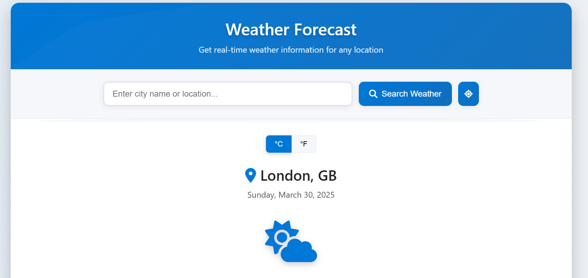

# Mojo Weather 🌤️

Welcome to **Mojo Weather**, a sleek, fast, and open-source weather application built to deliver real-time weather information for any city in the world! Powered by the OpenWeatherMap API, this app combines a modern, responsive design with accurate weather data, including current conditions, hourly updates, and a 5-day forecast.

Whether you're a casual user checking the forecast or a developer looking to contribute, Mojo Weather is designed with simplicity and extensibility in mind.

## Features ✨

- **Global Coverage**: Get weather data for any city worldwide.
- **Real-Time Updates**: Powered by OpenWeatherMap API for up-to-date information.
- **Responsive Design**: Works seamlessly on desktop, tablet, and mobile devices.
- **Unit Toggle**: Switch between Celsius (°C) and Fahrenheit (°F) with ease.
- **Geolocation Support**: Use your current location to fetch weather data instantly.
- **Detailed Insights**: Includes temperature, humidity, wind speed, air pressure, visibility, and more.
- **Hourly & 5-Day Forecast**: Plan ahead with hourly updates and a 5-day outlook.
- **Weather Alerts**: Stay informed with real-time weather warnings (when available).
- **Cached Data**: Optimized with a 10-minute cache to reduce API calls and improve performance.
- **Open Source**: Licensed under the MojoLicense—feel free to contribute or adapt!

## Demo 🎥

Check out a live demo [here](https://mojo-weather.netlify.app/) or explore the screenshots below:



## Installation 🚀

Follow these steps to get Mojo Weather up and running locally:

### Prerequisites
- A modern web browser (Chrome, Firefox, Edge, etc.)
- An internet connection (for API calls)
- [OpenWeatherMap API Key](https://openweathermap.org/api) *(free tier available)*

### Steps
1. **Clone the Repository**:
   ```bash
   git clone https://github.com/Muhammad-Noraeii/weather-app.git
   cd weather-app
   ```

2. **Set Up Your API Key**:
   - Sign up for a free API key at [OpenWeatherMap](https://openweathermap.org/api).
   - Open `script.js` and replace the `API_KEY` in the `CONFIG` object with your key:
     ```javascript
     API_KEY: 'your-api-key-here',
     ```

3. **Host Locally**:
   - Use a local server (e.g., `live-server` for VS Code, or Python’s HTTP server):
     ```bash
     python -m http.server 8000
     ```
   - Open your browser and navigate to `http://localhost:8000`.

4. **Enjoy!**: Start searching for cities or use the geolocation feature.

## Usage 🖱️

- **Search**: Type a city name (e.g., "Tokyo") into the search bar and hit Enter or click the search button.
- **Geolocation**: Click the location button to fetch weather for your current position.
- **Units**: Toggle between °C and °F using the buttons above the weather display.
- **Explore**: Scroll down to view detailed weather stats, hourly updates, and the 5-day forecast.

## Project Structure 📂

```
weather-app/
├── index.html       # Main HTML file
├── style.css        # Styling with CSS variables and animations
├── script.js        # Core logic, API calls, and DOM manipulation
├── LICENSE          # MojoLicense file (to be added)
└── README.md        # This file
```

## Technologies Used 🛠️

- **HTML5**: Semantic and accessible structure.
- **CSS3**: Modern styling with custom properties, animations, and responsive design.
- **JavaScript (ES6+)**: Dynamic functionality with async API calls and modular code.
- **Font Awesome**: Icons for weather conditions and UI elements.
- **OpenWeatherMap API**: Reliable weather data source.

## Contributing 🤝

We welcome contributions from the community! Here’s how you can help:

1. **Fork the Repository**: Click "Fork" on GitHub.
2. **Create a Branch**: `git checkout -b feature/your-feature-name`
3. **Make Changes**: Add features, fix bugs, or improve documentation.
4. **Submit a Pull Request**: Open a PR with a clear description of your changes.

Please adhere to the [Code of Conduct](#) *(link to be added)* and check the [issues](https://github.com/Muhammad-Noraeii/weather-app/issues) page for inspiration.

## License 📜

Mojo Weather is open-source and distributed under the **MojoLicense**. See the [LICENSE](LICENSE) file for details.

## Credits 🙌

- **Author**: Muhammad Noraeii
- **Email**: [Muhammad.Noraeii@gmail.com](mailto:Muhammad.Noraeii@gmail.com)
- **Organization**: MojoX
- **Data Provider**: [OpenWeatherMap](https://openweathermap.org/)

Developed with ❤️ by Muhammad Noraeii © 2020–2025.

## Roadmap 🗺️

- [ ] Add support for multiple languages.
- [ ] Implement dark mode toggle.
- [ ] Enhance air quality data with additional APIs.
- [ ] Add offline mode with cached forecasts.

Got ideas? Open an issue to discuss!

## Support 💬

Encounter a bug or have a question? Feel free to:
- Open an [issue](https://github.com/Muhammad-Noraeii/weather-app/issues) on GitHub.
- Email me at [Muhammad.Noraeii@gmail.com](mailto:Muhammad.Noraeii@gmail.com).

Happy forecasting! 🌞🌧️❄️

---

### Notes for You:
- Replace `Muhammad-Noraeii` with your actual GitHub username if you plan to host this on GitHub.
- Add a screenshot or demo link if you have one available.
- If you have a specific `LICENSE` file, ensure it’s included in the repo and linked properly.
- Customize the "Roadmap" section based on your future plans for the app.

